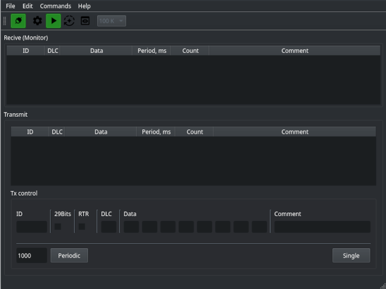

# LawicelViewer

## Описание
    Программа работает как CAN hacker на основе протокола LAWICEL v3. Для отработки использовалась Arduino Nano.
    Это программное обеспечение состоит из 2-х частей:
    1. Программа для ПК (на основе SDK Qt 5.14)
    2. Программа - прошивка для arduino

## Программа для ПК
За основу внешнего вида была взята программа CanHacker GUI. В дальнейшем будет перерабатываться.
Внешний вид показан на рисунке:

## Программа прошивка для arduino
Разработка велась в PlatformIO. Проект написан именно под эту IDE. Для работы использовалась Arduino Nano 168.
Для рвботы была использована библиотека MCP2515.
Соединение проводилось по следующей схеме:

## Changelog
2023.10.15
1. ДоступнЫ прием и передача пакетов
2. Управление режимами работы (кроме Loopback)
3. Управление скоростью работы
